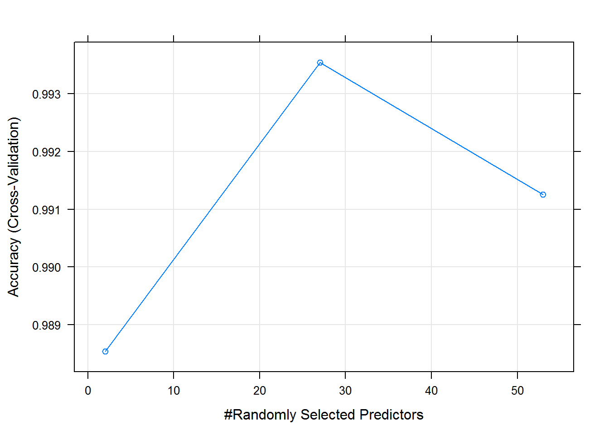
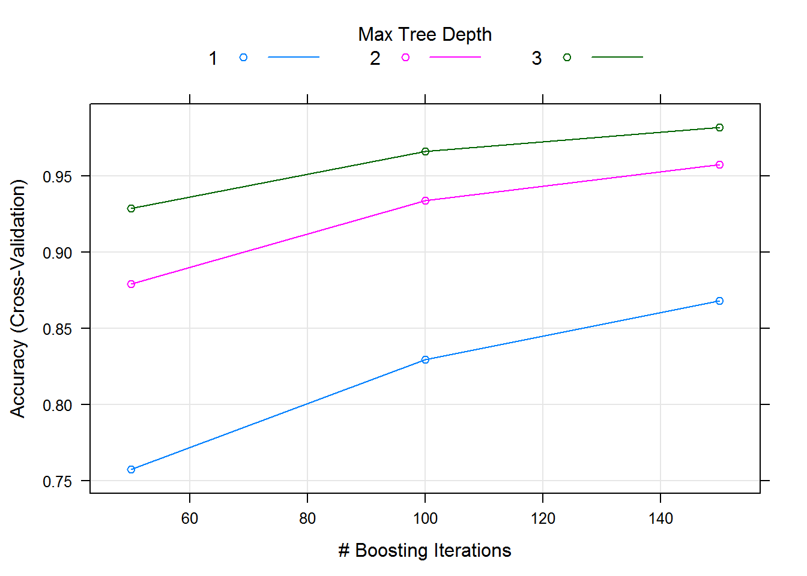
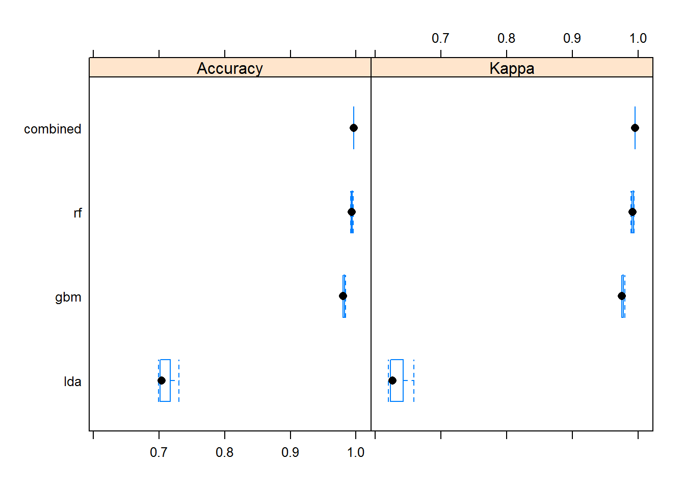

```{r setup, include=FALSE}
knitr::opts_chunk$set(echo = TRUE)
```

## Introduction
Using devices such as Jawbone Up, Nike FuelBand, and Fitbit it is now possible to collect a large amount of data about personal activity relatively inexpensively. These type of devices are part of the quantified self movement a group of enthusiasts who take measurements about themselves regularly to improve their health, to find patterns in their behavior, or because they are tech geeks. One thing that people regularly do is quantify how much of a particular activity they do, but they rarely quantify how well they do it. In this project, your goal will be to use data from accelerometers on the belt, forearm, arm, and dumbell of 6 participants. They were asked to perform barbell lifts correctly and incorrectly in 5 different ways. More information is available from the website here: http://groupware.les.inf.puc-rio.br/har (see the section on the Weight Lifting Exercise Dataset).

##Getting and Cleaning data

Below are the steps involved in getting and cleaning data
1. Include necessary R packages and import data files.
```{r}
suppressMessages(library(readr))
suppressMessages(library(caret))
suppressMessages(library(rpart))
suppressMessages(library(randomForest))
suppressMessages(library(ROCR))
suppressMessages(library(purrr))
suppressMessages(library(tidyr))
```
2. Importing datafiles into R dataframe and display number of NAs for each column.
```{r}
training <- suppressWarnings(suppressMessages(read_csv("https://d396qusza40orc.cloudfront.net/predmachlearn/pml-training.csv")))
testing <- suppressWarnings(suppressMessages(read_csv("https://d396qusza40orc.cloudfront.net/predmachlearn/pml-testing.csv")))

#display NA counts
training %>%
  map_df(function(x) sum(is.na(x))) %>%
  gather(feature, num_nulls) %>%
  print(n = 15)
```
```{r}
## # A tibble: 160 x 2
##                 feature num_nulls
##                   <chr>     <int>
##  1                   X1         0
##  2            user_name         0
##  3 raw_timestamp_part_1         0
##  4 raw_timestamp_part_2         0
##  5       cvtd_timestamp         0
##  6           new_window         0
##  7           num_window         0
##  8            roll_belt         0
##  9           pitch_belt         0
## 10             yaw_belt         0
## 11     total_accel_belt         0
## 12   kurtosis_roll_belt     19216
## 13  kurtosis_picth_belt     19216
## 14    kurtosis_yaw_belt     19216
## 15   skewness_roll_belt     19216
## # ... with 145 more rows
```

3. Remove columns with NAs greater than 19K rows
And remove first 6 columns which contains ID, Names and timestamps
```{r}
#remove columns with more than 19K NAs
columns_with_na <- c(12,13,14,15,16,17,18,19,20,21,22,23,24,25,26,27,28,29,30,31,32,33,34,35,36,50,51,52,53,54,55,56,57,58,59,69,70,71,72,73,74,75,76,77,78,79,80,81,82,83,87,88,89,90,91,92,93,94,95,96,97,98,99,100,101,103,104,105,106,107,108,109,110,111,112,125,126,127,128,129,130,131,132,133,134,135,136,137,138,139,141,142,143,144,145,146,147,148,149,150)
training <- training[,-columns_with_na]
#remove first 7 columns, they are IDs,names and timestamps
training <- training[,-c(1:6)]
```
4. Insert missing values with Median and validate data frame for any NAs
```{r}
#insert missing values with Median.
training$magnet_dumbbell_z[is.na(training$magnet_dumbbell_z)] <- median(training$magnet_dumbbell_z, na.rm = T)
training$magnet_forearm_y[is.na(training$magnet_forearm_y)] <- median(training$magnet_forearm_y, na.rm = T)
training$magnet_forearm_z[is.na(training$magnet_forearm_z)] <- median(training$magnet_forearm_z, na.rm = T)

#Validate all columns for NAs
training %>%
  map_df(function(x) sum(is.na(x))) %>%
  gather(feature, num_nulls) %>%
  print(n = 15)
```
```{r}
## # A tibble: 54 x 2
##             feature num_nulls
##               <chr>     <int>
##  1       num_window         0
##  2        roll_belt         0
##  3       pitch_belt         0
##  4         yaw_belt         0
##  5 total_accel_belt         0
##  6     gyros_belt_x         0
##  7     gyros_belt_y         0
##  8     gyros_belt_z         0
##  9     accel_belt_x         0
## 10     accel_belt_y         0
## 11     accel_belt_z         0
## 12    magnet_belt_x         0
## 13    magnet_belt_y         0
## 14    magnet_belt_z         0
## 15         roll_arm         0
## # ... with 39 more rows
```

5. Change column data type for target variable "Classe" to factor and align the testing dataset with same number of columns as training.
```{r}
suppressMessages(library(dplyr))
#check for column data type
#sapply(training, function(x) class(x))
#change data type to factor
training$classe <- factor(training$classe)

#Apply same data prepration for testing dataset and remove target variable "Classe"
testing <- testing[,-columns_with_na]
testing <- testing[,-c(1:6)]
```

#Classification Algorithm

In this section, different classification algorithm will be applied to training data and compare its accuracy. To start with, lets split the training data into two parts.

```{r}
#split training data into two sets to train and set models
inTrain <- createDataPartition(y=training$classe, p = 0.60, list=FALSE)
mytraining <- training[inTrain,]
mytesting <- training[-inTrain,]
```


Setting seed and making the cross validation to 3, it will split the training data into 3 parts for cross validation.

####Prediction with Random forrest
```{r}
set.seed(123)
tc <- trainControl(method = "cv", number = 3)
modfit_rf <- train(classe ~ ., data = mytraining, method = "rf", trControl = tc)
pred_rf <- predict(modfit_rf, mytesting)
confusionMatrix(pred_rf, mytesting$classe)
plot(modfit_rf)
```

```{r}
## Confusion Matrix and Statistics
## 
##           Reference
## Prediction    A    B    C    D    E
##          A 2232    6    0    0    0
##          B    0 1510    5    0    0
##          C    0    2 1363    6    0
##          D    0    0    0 1280    7
##          E    0    0    0    0 1435
## 
## Overall Statistics
##                                           
##                Accuracy : 0.9967          
##                  95% CI : (0.9951, 0.9978)
##     No Information Rate : 0.2845          
##     P-Value [Acc > NIR] : < 2.2e-16       
##                                           
##                   Kappa : 0.9958          
##  Mcnemar's Test P-Value : NA              
## 
## Statistics by Class:
## 
##                      Class: A Class: B Class: C Class: D Class: E
## Sensitivity            1.0000   0.9947   0.9963   0.9953   0.9951
## Specificity            0.9989   0.9992   0.9988   0.9989   1.0000
## Pos Pred Value         0.9973   0.9967   0.9942   0.9946   1.0000
## Neg Pred Value         1.0000   0.9987   0.9992   0.9991   0.9989
## Prevalence             0.2845   0.1935   0.1744   0.1639   0.1838
## Detection Rate         0.2845   0.1925   0.1737   0.1631   0.1829
## Detection Prevalence   0.2852   0.1931   0.1747   0.1640   0.1829
## Balanced Accuracy      0.9995   0.9970   0.9976   0.9971   0.9976
```

 


####Prediction with Linear discriminant analysis (LDA)
```{r}
set.seed(123)
modfit_lda <- train(classe ~ ., data = mytraining, method = "lda", trControl = tc)
pred_lda <- predict(modfit_lda, mytesting)
confusionMatrix(pred_lda, mytesting$classe)
```
```{r}
## Confusion Matrix and Statistics
## 
##           Reference
## Prediction    A    B    C    D    E
##          A 1847  197  136   78   55
##          B   70  997  143   52  219
##          C  155  191  883  164  136
##          D  150   57  151  940  144
##          E   10   76   55   52  888
## 
## Overall Statistics
##                                          
##                Accuracy : 0.708          
##                  95% CI : (0.6978, 0.718)
##     No Information Rate : 0.2845         
##     P-Value [Acc > NIR] : < 2.2e-16      
##                                          
##                   Kappa : 0.6305         
##  Mcnemar's Test P-Value : < 2.2e-16      
## 
## Statistics by Class:
## 
##                      Class: A Class: B Class: C Class: D Class: E
## Sensitivity            0.8275   0.6568   0.6455   0.7309   0.6158
## Specificity            0.9170   0.9235   0.9003   0.9235   0.9699
## Pos Pred Value         0.7985   0.6732   0.5775   0.6519   0.8215
## Neg Pred Value         0.9304   0.9181   0.9232   0.9460   0.9181
## Prevalence             0.2845   0.1935   0.1744   0.1639   0.1838
## Detection Rate         0.2354   0.1271   0.1125   0.1198   0.1132
## Detection Prevalence   0.2948   0.1888   0.1949   0.1838   0.1378
## Balanced Accuracy      0.8723   0.7901   0.7729   0.8272   0.7928
```


####Prediction with Recursive partitioning for classification (RPart)
```{r}
set.seed(123)
modfit_rpart <- train(classe ~ ., data = mytraining, method = "rpart", trControl = tc)
pred_rpart <- predict(modfit_rpart, mytesting)
confusionMatrix(pred_rpart, mytesting$classe)
```
```{r}
## Confusion Matrix and Statistics
## 
##           Reference
## Prediction    A    B    C    D    E
##          A 2016  631  627  566  214
##          B   35  515   47  236  197
##          C  173  372  694  484  387
##          D    0    0    0    0    0
##          E    8    0    0    0  644
## 
## Overall Statistics
##                                          
##                Accuracy : 0.4931         
##                  95% CI : (0.482, 0.5042)
##     No Information Rate : 0.2845         
##     P-Value [Acc > NIR] : < 2.2e-16      
##                                          
##                   Kappa : 0.3378         
##  Mcnemar's Test P-Value : NA             
## 
## Statistics by Class:
## 
##                      Class: A Class: B Class: C Class: D Class: E
## Sensitivity            0.9032  0.33926  0.50731   0.0000  0.44660
## Specificity            0.6370  0.91862  0.78141   1.0000  0.99875
## Pos Pred Value         0.4973  0.50000  0.32891      NaN  0.98773
## Neg Pred Value         0.9430  0.85285  0.88250   0.8361  0.88907
## Prevalence             0.2845  0.19347  0.17436   0.1639  0.18379
## Detection Rate         0.2569  0.06564  0.08845   0.0000  0.08208
## Detection Prevalence   0.5167  0.13128  0.26893   0.0000  0.08310
## Balanced Accuracy      0.7701  0.62894  0.64436   0.5000  0.72268
```

####Prediction with gradient boosting machine (GBM)
```{r}
set.seed(123)
modfit_gbm <- train(classe ~ ., data = mytraining, method = "gbm", trControl = tc, verbose = FALSE)
pred_gbm <- predict(modfit_gbm, mytesting)
confusionMatrix(pred_gbm, mytesting$classe)
plot(modfit_gbm)
```
```{r}
## Confusion Matrix and Statistics
## 
##           Reference
## Prediction    A    B    C    D    E
##          A 2230   12    0    0    0
##          B    1 1479   22    4    0
##          C    0   24 1343   15    4
##          D    1    3    3 1267   17
##          E    0    0    0    0 1421
## 
## Overall Statistics
##                                           
##                Accuracy : 0.9865          
##                  95% CI : (0.9837, 0.9889)
##     No Information Rate : 0.2845          
##     P-Value [Acc > NIR] : < 2.2e-16       
##                                           
##                   Kappa : 0.9829          
##  Mcnemar's Test P-Value : NA              
## 
## Statistics by Class:
## 
##                      Class: A Class: B Class: C Class: D Class: E
## Sensitivity            0.9991   0.9743   0.9817   0.9852   0.9854
## Specificity            0.9979   0.9957   0.9934   0.9963   1.0000
## Pos Pred Value         0.9946   0.9821   0.9690   0.9814   1.0000
## Neg Pred Value         0.9996   0.9938   0.9961   0.9971   0.9967
## Prevalence             0.2845   0.1935   0.1744   0.1639   0.1838
## Detection Rate         0.2842   0.1885   0.1712   0.1615   0.1811
## Detection Prevalence   0.2858   0.1919   0.1767   0.1645   0.1811
## Balanced Accuracy      0.9985   0.9850   0.9875   0.9908   0.9927
```
 


####Prediction with combined with Random forrest
```{r}
predDF <- data.frame(pred_rf, pred_gbm, pred_lda, classe = mytesting$classe)
combModFit <- train(classe ~ ., method = "rf", data = predDF,trControl=tc)
combPred <- predict(combModFit, predDF)
confusionMatrix(combPred, mytesting$classe)
```
```{r}
## Confusion Matrix and Statistics
## 
##           Reference
## Prediction    A    B    C    D    E
##          A 2232    4    0    0    0
##          B    0 1512    5    0    0
##          C    0    2 1363    5    0
##          D    0    0    0 1281    7
##          E    0    0    0    0 1435
## 
## Overall Statistics
##                                           
##                Accuracy : 0.9971          
##                  95% CI : (0.9956, 0.9981)
##     No Information Rate : 0.2845          
##     P-Value [Acc > NIR] : < 2.2e-16       
##                                           
##                   Kappa : 0.9963          
##  Mcnemar's Test P-Value : NA              
## 
## Statistics by Class:
## 
##                      Class: A Class: B Class: C Class: D Class: E
## Sensitivity            1.0000   0.9960   0.9963   0.9961   0.9951
## Specificity            0.9993   0.9992   0.9989   0.9989   1.0000
## Pos Pred Value         0.9982   0.9967   0.9949   0.9946   1.0000
## Neg Pred Value         1.0000   0.9991   0.9992   0.9992   0.9989
## Prevalence             0.2845   0.1935   0.1744   0.1639   0.1838
## Detection Rate         0.2845   0.1927   0.1737   0.1633   0.1829
## Detection Prevalence   0.2850   0.1933   0.1746   0.1642   0.1829
## Balanced Accuracy      0.9996   0.9976   0.9976   0.9975   0.9976
```


#Compare all the models
using machine learning benchmark package, compare all the models

```{r}
library(mlbench)
results <- resamples(list(lda=modfit_lda, rf = modfit_rf,gbm=modfit_gbm,combined=combModFit))
# summarize the distributions
summary(results)
# boxplots of results
bwplot(results)
```
```{r}
## 
## Call:
## summary.resamples(object = results)
## 
## Models: lda, rf, gbm, combined 
## Number of resamples: 3 
## 
## Accuracy 
##               Min.   1st Qu.    Median      Mean   3rd Qu.      Max. NA's
## lda      0.6994647 0.7017446 0.7040245 0.7113574 0.7173038 0.7305831    0
## rf       0.9915945 0.9926109 0.9936273 0.9935461 0.9945218 0.9954163    0
## gbm      0.9803872 0.9803897 0.9803922 0.9817433 0.9824214 0.9844507    0
## combined 0.9965583 0.9965583 0.9965583 0.9965588 0.9965590 0.9965596    0
## 
## Kappa 
##               Min.   1st Qu.    Median      Mean   3rd Qu.      Max. NA's
## lda      0.6199120 0.6229525 0.6259929 0.6349112 0.6424107 0.6588285    0
## rf       0.9893682 0.9906532 0.9919382 0.9918361 0.9930700 0.9942018    0
## gbm      0.9751865 0.9751905 0.9751945 0.9769029 0.9777611 0.9803278    0
## combined 0.9956461 0.9956461 0.9956462 0.9956470 0.9956474 0.9956487    0
```
 

#Conclusion 
Baed on the comparsion box plot, Combined model outperformed with all other models.
Predicting final test data with Random Forrest model.
```{r}
#final testing data set
#predict(combModFit, testing)
predictTEST <- predict(modfit_rf, newdata=testing)
predictTEST
```

```{r}
##  [1] B A B A A E D B A A B C B A E E A B B B
## Levels: A B C D E
```